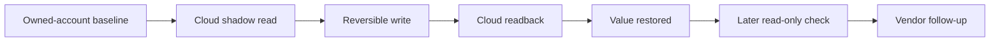

# SwitchBot Local IoT Research

[](https://github.com/newcharacter/switchbot-local-iot-research/actions/workflows/tests.yml)

Responsible disclosure, remediation retesting, and local-control engineering from a SwitchBot consumer-IoT investigation.

After SwitchBot acknowledged the report and gave a remediation window, a 2026-04-30 retest still showed the cloud accepting and returning unexpected writes to device-owned/read-only shadow properties. The active write tests stayed inside my own account and devices, and the changed values were restored immediately. That is an ethical testing boundary, not proof that the issue was account-local: the observed failure was in the cloud validation path.

Related public artifact-listing and certificate-metadata concerns also remained observable after the same remediation window. MQTT authentication evidence stayed private because the raw material is operationally sensitive.

This repo shows the research shape, disclosure trail, remediation validation, and local-control engineering direction without publishing raw captures, reusable credentials, private identifiers, or copy-paste reproduction steps.

## Core Issue

Cloud shadow state is often treated like device truth by apps, support tooling, dashboards, and automations. It should not be. If a cloud shadow write path accepts values that should be device-owned, read-only, type-constrained, or range-constrained, downstream systems can be misled even when the physical device has not changed.

The retest showed that this was not just a stale report waiting for a fix window to expire. After the vendor's stated remediation target, tested shadow values could still be modified and read back through the cloud path.

## The Work

- Mapped the difference between the public API surface and richer internal device state paths.
- Found cloud-shadow properties accepting values that should have been rejected server-side.
- Built a retest harness that read baselines, applied reversible writes, confirmed readback, and restored values.
- Rechecked the vendor's promised remediation window instead of treating acknowledgement as closure.
- Kept active mutation inside owned accounts/devices while preserving the platform-level validation question.
- Started a Home Assistant/local-control path with MQTT/BLE decoder scaffolding.

## Findings At A Glance

| Area | Public conclusion | Status from 2026-04-30 retest |
|---|---|---|
| Cloud-shadow validation | Cloud accepted and returned modified values for tested device-owned/read-only shadow properties | Reproduced after vendor remediation target |
| Public artifact exposure | Vendor artifact delivery exposed broader public inventory than a narrow firmware-delivery path needs | Still observable |
| Production metadata hygiene | Production-facing metadata still exposed test-looking certificate material | Still observable |
| MQTT/local-control thread | App-derived MQTT authentication evidence remained live, with topic-permission breadth not publicly assessed | Kept in private disclosure lane |

## Evidence Chain



The point of the chain is that the proof was repeatable, reversible, and scoped. The active test boundary was owned devices and accounts. The impact boundary is broader: server-side validation for a shared cloud-shadow path.

## Why It Matters

Consumer IoT products often make cloud shadow state look like device truth. That is useful for dashboards, mobile apps, support tooling, and home automation. It is also a trust boundary. If server-side validation is weak, integrations can be misled even when the physical device has not changed.

This project is about that boundary: finding it, reporting it, retesting it, and then building a less cloud-dependent way to observe and control devices locally.

## Why This Repo Is Worth Reading

- It is not just an initial bug report. It includes a retest after the vendor's stated remediation target.
- It treats cloud/device state as an engineering system, not just an HTTP endpoint.
- It connects the security finding to practical local-control work instead of leaving the work as a dead-end disclosure note.
- It is specific about what failed while keeping raw exploit material and secret-bearing artifacts out of the public repo.

## Repository Map

- `docs/case-study.md` - the full public narrative.
- `docs/research-map.md` - map of the wider private workstream at a public level.
- `docs/findings.md` - findings, impact, and limits without reproduction payloads.
- `docs/disclosure-timeline.md` - disclosure and retest chronology.
- `docs/architecture.md` - cloud, OEM, shadow-state, and local-control architecture.
- `docs/remediation-validation.md` - how the retest loop was designed.
- `docs/defensive-recommendations.md` - practical fixes for platform owners.
- `docs/local-control-prototype.md` - Home Assistant and MQTT/BLE engineering direction.
- `docs/ethics-and-scope.md` - research scope and disclosure posture.
- `docs/evidence-and-limits.md` - what is proven, what remains open, and why.
- `src/switchbot_research/mqtt_decoder.py` - sanitized decoder example using synthetic data.
- `scripts/decode_synthetic.py` - runnable demo over synthetic examples.
- `examples/synthetic-messages.json` - synthetic fixtures used by the demo.
- `tests/test_mqtt_decoder.py` - regression tests for the sanitized decoder.

## Try The Public Demo

```bash
python3 tests/test_mqtt_decoder.py
python3 scripts/decode_synthetic.py examples/synthetic-messages.json
```

The demo decodes synthetic payloads only. It is not a SwitchBot client and it does not contain broker endpoints, credentials, topics, captures, or real device identifiers.

## Current State

Coordinated disclosure remains the right lane for raw details. This public repo is a research and engineering record, not a reproduction guide.
