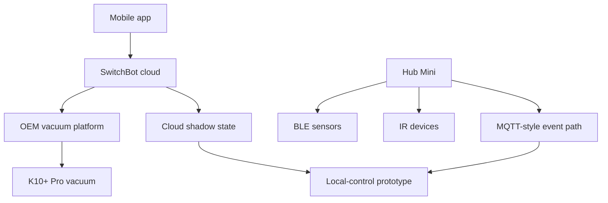

# Architecture

The private project mapped three overlapping systems:

- the mobile app and SwitchBot cloud,
- the OEM vacuum platform underneath the SwitchBot wrapper,
- the local Hub/MQTT/BLE path used by sensors and remotes.

The public repo keeps the architecture conceptual. It avoids exact hosts, topics, credentials, identifiers, and request payloads.

## System Shape

## Public API vs Internal State

The public developer API exposed a small control surface for the vacuum. The internal app-facing APIs exposed a much richer state model: full device state, writable settings, action dispatch, shadow properties, firmware metadata, scenes, rooms, and home-group context.

That split is important because the public API makes the device look simple, while the app-facing layer reveals a complex cloud/device state machine.

## Two State Models

The private research found two state models that did not behave as a single perfectly synchronized source of truth:

| Layer | Shape | Why it matters |
|---|---|---|
| Cloud shadow | Numeric property identifiers | Useful for app/device state, but needs strict validation. |
| OEM device state | Named settings and actions | Richer vacuum controls and commands. |

The cloud-shadow validation finding lives at this boundary. If a shadow property is treated as truth by apps or integrations, weak validation can mislead downstream systems even when the physical device has not changed.

## Event Path

The Hub/local-control work points toward an event-driven model:

1. observe device or sensor events,
2. normalize them into explicit event types,
3. label the source of each value,
4. merge values into Home Assistant without pretending every value has the same authority.

That is why the public code focuses on a decoder rather than a full client. The useful public artifact is the data-shaping pattern, not credentials or live connectivity.

## Design Principle

Cloud state is an input. Device state is an input. Local observations are inputs. A robust home automation integration should keep those sources distinguishable instead of flattening them into one unquestioned truth value.
