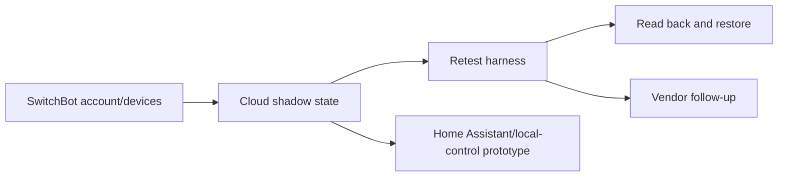

# Responsible Disclosure And Local-Control Validation In Consumer IoT

## Summary

I investigated SwitchBot cloud-shadow behaviour, reported security findings through responsible disclosure, retested the vendor's remediation claims, and started turning the protocol work into a local-control/Home Assistant direction.

The central finding is a cloud validation problem. After SwitchBot's remediation target, tested device-owned/read-only shadow properties still accepted modified values and returned them on readback. The write tests stayed inside my own account and devices and were immediately restored, but the finding sits in the cloud path, not in a local test harness.

## Research Shape

## What Was Found

The strongest finding was a cloud-shadow validation failure: tested properties accepted and persisted modified values that should have been constrained by the server side of the platform.

Two other public-facing surfaces remained relevant after retest: broad artifact listing behaviour and test-looking certificate metadata. A related MQTT authentication result stayed in the private disclosure lane because publishing connection details would be too close to operational guidance.

## Why It Matters

Consumer IoT systems often present cloud state as device truth. If cloud-shadow writes are not validated server-side, dashboards, automations, support tooling, or integrations can be misled even when the physical device has not changed. That is not just a security concern; it is a reliability concern for anyone building on top of vendor clouds.

The practical lesson is simple: cloud state should be treated as an input to validate, not as an authority by default.

## What I Built

- A scoped retest harness for baseline reads, reversible writes, readback, and restoration.
- A private evidence bundle for vendor follow-up.
- A public narrative that separates observed behaviour from untested risk.
- MQTT/BLE decoder scaffolding for a local-control path.
- Synthetic tests for the decoder logic in this repo.

## Engineering Takeaways

- Evidence is more useful when it is structured for retesting, not just for proving a point once.
- Vendor remediation claims need a careful validation loop.
- Local observability can make consumer IoT systems less dependent on opaque cloud state.
- Keeping private evidence separate from public project material makes it easier to talk about the work responsibly.

## Short Version

I found and responsibly disclosed cloud-shadow integrity issues in a consumer IoT system, retested the vendor's remediation claims, and used the protocol work as the start of a Home Assistant/local-control prototype.
