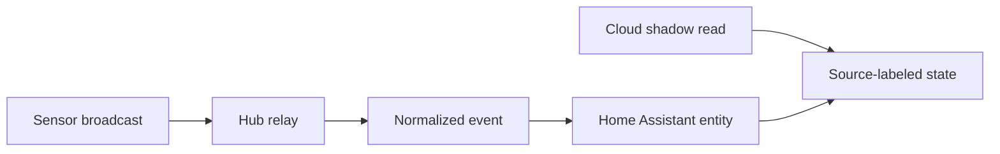

# Local-Control Prototype

The security research also exposed a practical engineering problem: cloud state is useful, but opaque. If a home automation system depends on vendor cloud shadows, it inherits that cloud's validation and freshness problems.

The local-control work asks a different question:

> How much useful SwitchBot device state can be observed and normalized closer to the home, without treating the vendor cloud as the only source of truth?

## Direction

- Decode MQTT/BLE-style sensor payloads into normalized events.
- Merge real-time observations with Home Assistant entity state.
- Keep raw vendor credentials and captures out of the public implementation.
- Prefer synthetic fixtures and small regression tests for public examples.



## Decoder Example

The example decoder in `src/switchbot_research/mqtt_decoder.py` is deliberately sanitized. It uses synthetic payloads to show the shape of the work:

- normalize MAC-like identifiers,
- detect forward and reversed byte order,
- decode temperature, humidity, and battery fields from service data,
- extract shadow-update events from JSON-shaped messages.

It is not a working SwitchBot client and does not contain broker endpoints, certificates, keys, tokens, topics, or real captures.

## Why This Belongs With The Disclosure Work

The same discipline applies to both security research and home automation:

- know which source produced a value,
- avoid treating one cloud field as absolute truth,
- preserve enough structure to retest behaviour later,
- keep sensitive operational material out of public code.

The prototype is early, but the direction is clear: reduce cloud dependency while improving observability.

## Public Demo

Run the tests and demo from the repository root:

```bash
python3 tests/test_mqtt_decoder.py
python3 scripts/decode_synthetic.py examples/synthetic-messages.json
```

The demo prints normalized events from synthetic messages. It is useful because it makes the data-shaping work visible without requiring real credentials or captures.
