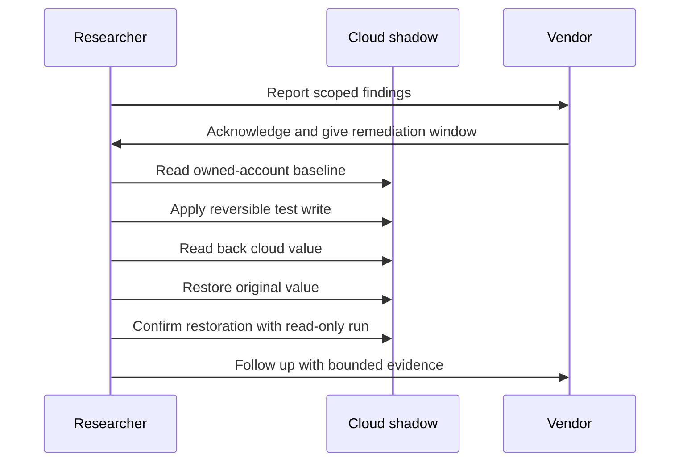

# Remediation Validation

Vendor acknowledgement is useful, but it is not the same thing as remediation. The point of the retest was to check the cloud path after the promised fix window, not to assume closure because a ticket had been answered.

## Retest Shape

## Why The Loop Matters

The retest was designed to answer a specific question:

> Did the cloud-shadow path still accept and return unexpected values after the remediation target?

It was not designed to prove every possible impact. It kept the evidence tight enough to be useful without drifting into unsafe testing.

## Guardrails

- Active mutation stayed inside my own account and devices.
- Read baseline before changing anything.
- Use bounded values that can be restored.
- Read back after the write.
- Restore immediately.
- Run a later read-only confirmation.
- Keep cross-account impact out of the proven claim unless tested with two owned accounts.

## Interpretation

The public finding does not claim physical mutation of the device. It claims cloud-shadow acceptance and readback. That is still meaningful because cloud-shadow state is consumed by apps, dashboards, support workflows, and automations.

The owned-account boundary is an ethical test boundary. It is not proof that the backend behaviour was limited to that account.

## What A Strong Fix Would Prove

A strong remediation would be testable:

- device-owned and read-only properties reject client-side writes,
- value ranges are enforced server-side,
- account and ownership checks are enforced on write paths,
- audit logs distinguish device-originated updates from app/client-originated updates,
- public artifact inventory is not broadly listable,
- production metadata is rotated and separated from test material.
